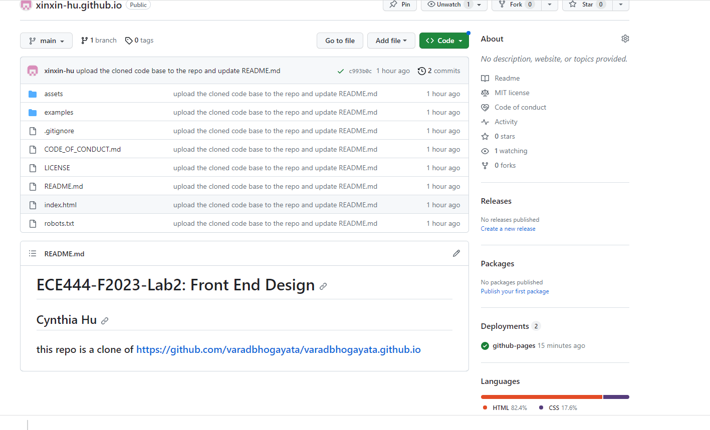
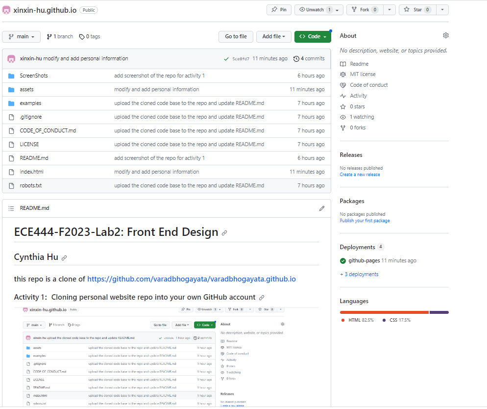
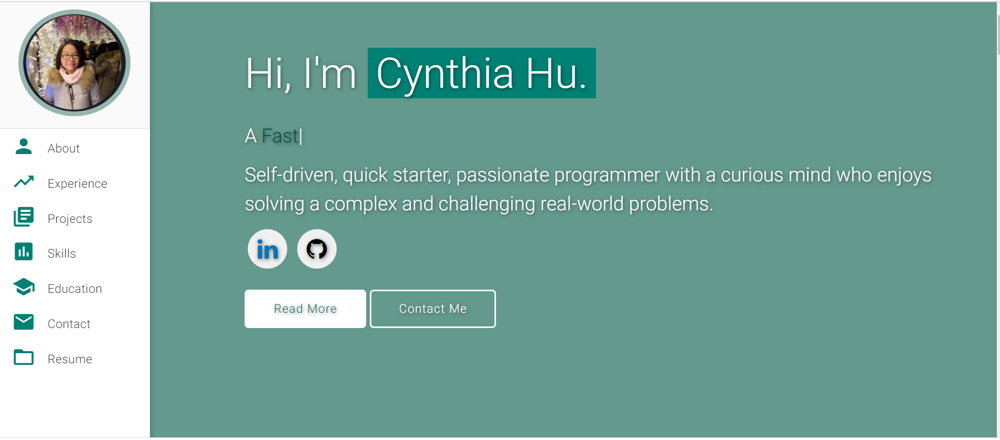
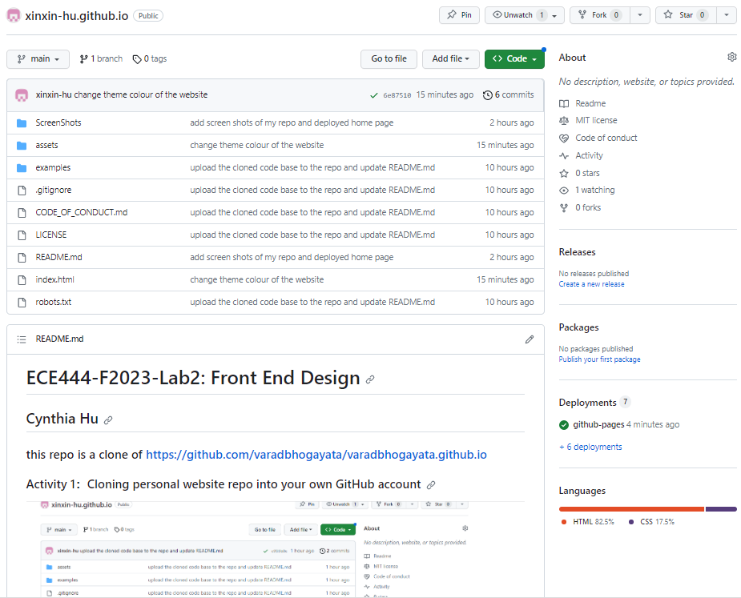
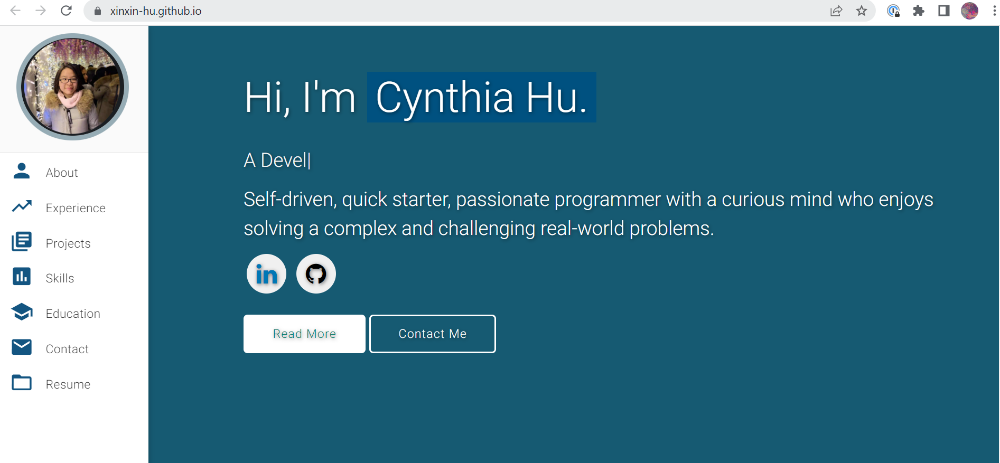

# ECE444-F2023-Lab2: Front End Design
## Cynthia Hu

### this repo is a clone of https://github.com/varadbhogayata/varadbhogayata.github.io

### Activity 1：Cloning personal website repo into your own GitHub account

### Activity 2: Adding your personal information
1. screen shot of repo, there are more deployments

2. home page of deployed website

### Activity 3：Changing the Theme Color of Your Personal Website
1. screen shot of the repo, there are 7 deployments now

2. home page of deployed website after changing the theme colour to dark blue
